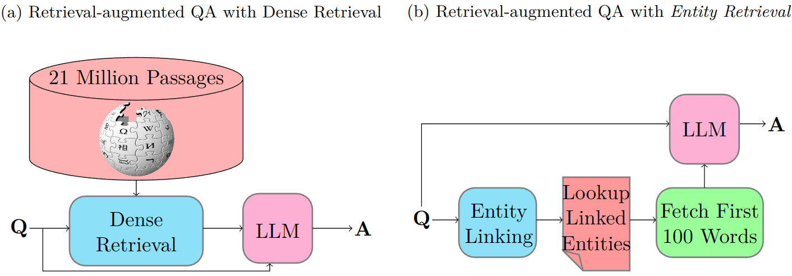

# Entity Retrieval: Entity Linking for Answering Entity-Centric Questions

This repository contains the implementation and the experiments from our paper 
"Entity Retrieval: Entity Linking for Answering Entity-Centric Questions", currently under review for EMNLP 2024.

## Quick Start

The implemented source code is stored under `src` directory. 
### How to add New Datastes
You can start by looking at the `data` package which
contains data readers for the datasets on which we have conducted our experiments.
To add a new dataset you can easily implement a new class which implements `data.loaders.utils.QADataset`. The most 
important functions to be implemented are `__iter__` and `__next__`. The `__next__` method must return instances of 
`data.loaders.utils.QARecord`. Once implemented add the new dataset to `data.loader.get_dataset` and you should be 
able to run all the experiments with the new dataset flawlessly.

### How to create pre-fetched retrieval repositories
As mentioned in the paper, we treat document retrieval as a pre-processing step, caching the most relevant passages 
for each question - considering different retrieval techniques - before conducting the question answering experiments.
[`prefetch_pyserini_retrieval_documents.sh`](src/prefetch_pyserini_retrieval_documents.sh) located directly under `src` directory, creates all such pre-fetched passages and 
stores them for re-use in experiments. You may use the same script with slight modifications for creating pre-processed
passage repositories for your newly added datasets. Please note that the underlying implementation for these processes
uses [PySerini](https://github.com/castorini/pyserini) and loads pre-built FAISS indexes for dense retrieval techniques. Such processes can require up to 65GBs
of main memory and about the same amount of available disk storage to download and store the index.

For entity retrieval prefetched documents, you may follow the same procedure using [`prefetch_entity_retrieval_documents.sh`](src/prefetch_entity_retrieval_documents.sh). 
Please remember to instantiate the entity linker directory using `git submodule update --init --recursive` before running this script.

You may use run [`analyze_prefetched_documents.py`](src/model/retrievers/analyze_prefetched_documents.py) to create retrieval coverage analysis plots.